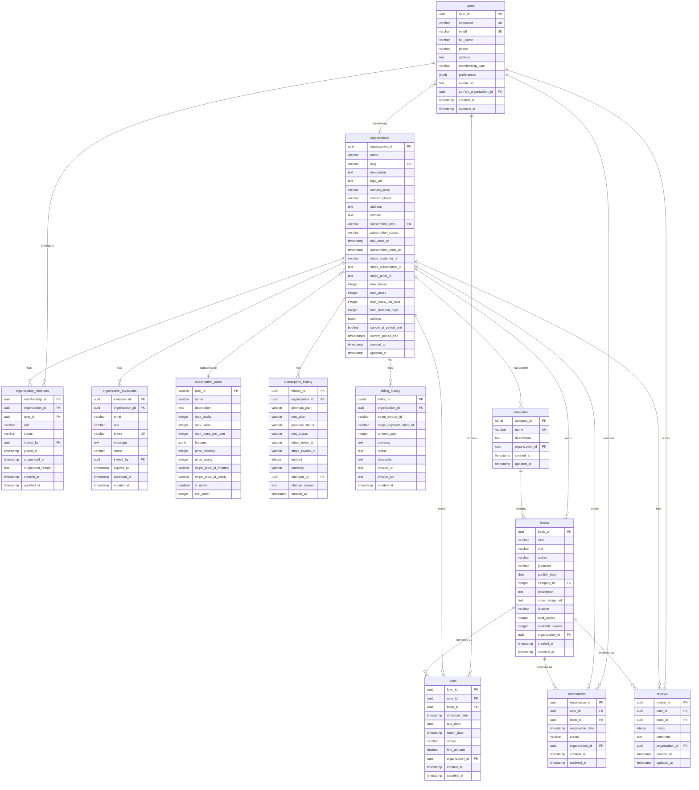

# CLAUDE.md

This file provides comprehensive guidance to Claude Code when working with this codebase.

## Project Overview

**LibraryOS** - A multi-tenant library management system built with modern web technologies. This SaaS platform allows organizations to manage their book collections, track loans, handle reservations, and manage team members with role-based access control.

### Key Features
- **Multi-tenancy**: Organizations operate in isolated data environments
- **Subscription Plans**: Free, Basic, Pro, Enterprise tiers with Stripe integration
- **Role-based Access**: Owner, Admin, Librarian, Member roles
- **Book Management**: Catalog, borrowing, reservations, reviews
- **Team Management**: Invitations, member roles, organization settings

## Tech Stack

| Layer | Technologies |
|-------|-------------|
| **Frontend** | Next.js 16 (App Router), React 19, TypeScript, TailwindCSS 4, shadcn/ui (Radix UI) |
| **Backend** | Supabase (PostgreSQL, Auth, RLS policies, Stored Procedures, Edge Functions) |
| **Payment** | Stripe (Subscriptions, Checkout, Billing Portal, Webhooks) |
| **Email** | Resend (Transactional emails) |
| **State** | React Context (AuthContext, OrganizationContext) |
| **Forms** | React Hook Form + Zod validation |

## Commands

```bash
# Development
npm run dev          # Start development server (http://localhost:3000)
npm run build        # Build for production
npm start            # Start production server
npm run lint         # Run ESLint

# Local Supabase Development
npx supabase start   # Start local Supabase instance
npx supabase stop    # Stop local Supabase instance
npx supabase db reset # Reset database with migrations
```

## Architecture

### Directory Structure

```
src/
├── app/                              # Next.js App Router
│   ├── api/
│   │   ├── auth/register/            # POST: User registration
│   │   ├── stripe/
│   │   │   ├── checkout/             # POST: Create Stripe checkout session
│   │   │   ├── portal/               # POST: Create billing portal session
│   │   │   └── webhook/              # POST: Handle Stripe webhooks
│   │   └── email/invite/             # POST: Send invitation emails
│   ├── (auth)/
│   │   ├── login/                    # Login page
│   │   └── register/                 # Registration page
│   ├── books/
│   │   ├── page.tsx                  # Book catalog (paginated, searchable)
│   │   ├── add/                      # Add new book (Librarian+)
│   │   └── [id]/
│   │       ├── page.tsx              # Book details
│   │       └── edit/                 # Edit book (Librarian+)
│   ├── dashboard/                    # User dashboard with stats
│   ├── org/
│   │   ├── select/                   # Organization selection
│   │   ├── create/                   # Create new organization
│   │   ├── join/                     # Join via invitation link
│   │   ├── members/                  # Member management (Admin+)
│   │   ├── settings/                 # Organization settings (Admin+)
│   │   └── billing/                  # Subscription & billing (Admin+)
│   ├── invite/[token]/               # Accept invitation
│   ├── privacy/                      # Privacy policy
│   ├── terms/                        # Terms of service
│   └── cookies/                      # Cookie policy
├── components/
│   ├── books/
│   │   ├── BookCard.tsx              # Book grid card with hover effects
│   │   └── SearchFilters.tsx         # Search input + category filter
│   ├── layout/
│   │   ├── Header.tsx                # Sticky nav with org switcher
│   │   └── Footer.tsx                # Multi-column footer
│   ├── organization/
│   │   └── OrganizationSwitcher.tsx  # Dropdown to switch orgs
│   └── ui/                           # shadcn/ui components (button, card, badge, etc.)
├── contexts/
│   ├── AuthContext.tsx               # User auth state, signIn/signUp/signOut
│   └── OrganizationContext.tsx       # Current org, role, permissions, stats
├── lib/
│   └── supabase-client.ts            # Supabase client (browser + admin)
└── types/
    ├── book.ts                       # Book, Category types
    ├── user.ts                       # User type
    ├── organization.ts               # Organization, Member, Invitation types
    └── supabase.ts                   # Generated Supabase types

supabase/
└── migrations/                       # Database migrations (numbered)
    ├── 20251229000001_initial_schema.sql
    ├── 20251229000002_seed_categories.sql
    ├── 20251230000001_create_organizations.sql
    ├── 20251230000002_add_multi_tenant_support.sql
    ├── 20251230000003_create_helper_functions.sql
    ├── 20251230000004_create_rls_policies.sql
    ├── 20251230000005_create_business_functions.sql
    ├── 20251230000006_create_invitation_system.sql
    ├── 20251231000001_add_subscription_plans.sql
    ├── 20251231000002_add_billing_history.sql
    └── ...
```

### Database Schema



### Table Descriptions

#### Core Business Tables

| Table | Description | Key Fields |
|-------|-------------|------------|
| `users` | User profiles linked to Supabase Auth | `user_id`, `email`, `username`, `current_organization_id` |
| `books` | Book catalog per organization | `book_id`, `isbn`, `title`, `author`, `available_copies`, `organization_id` |
| `categories` | Book categories (global + org-specific) | `category_id`, `name`, `organization_id` (null = global) |
| `loans` | Borrowing transactions | `loan_id`, `user_id`, `book_id`, `due_date`, `status`, `fine_amount` |
| `reservations` | Book reservations | `reservation_id`, `user_id`, `book_id`, `status` |
| `reviews` | User book reviews (1-5 rating) | `review_id`, `user_id`, `book_id`, `rating`, `comment` |

#### Multi-tenant Tables

| Table | Description | Key Fields |
|-------|-------------|------------|
| `organizations` | Tenant data with subscription info | `organization_id`, `slug`, `subscription_plan`, `subscription_status`, `stripe_*` |
| `organization_members` | User memberships with roles | `membership_id`, `organization_id`, `user_id`, `role`, `status` |
| `organization_invitations` | Pending invitations (7-day expiry) | `invitation_id`, `email`, `token`, `role`, `status`, `expires_at` |

#### Subscription Tables

| Table | Description | Key Fields |
|-------|-------------|------------|
| `subscription_plans` | Plan configuration | `plan_id`, `max_books`, `max_users`, `price_monthly`, `stripe_price_id_*` |
| `subscription_history` | Audit trail of plan changes | `history_id`, `previous_plan`, `new_plan`, `stripe_event_id` |
| `billing_history` | Payment records | `billing_id`, `amount_paid`, `status`, `invoice_url` |

### Role & Permission System

```
Role Hierarchy: Owner > Admin > Librarian > Member
```

| Permission | Owner | Admin | Librarian | Member |
|------------|:-----:|:-----:|:---------:|:------:|
| Browse books | Y | Y | Y | Y |
| Borrow/return books | Y | Y | Y | Y |
| Write reviews | Y | Y | Y | Y |
| Make reservations | Y | Y | Y | Y |
| Add/edit books | Y | Y | Y | - |
| Delete books | Y | Y | - | - |
| Manage members | Y | Y | - | - |
| Send invitations | Y | Y | - | - |
| Access billing | Y | Y | - | - |
| Change subscription | Y | Y | - | - |
| Organization settings | Y | Y | - | - |
| Delete organization | Y | - | - | - |
| Transfer ownership | Y | - | - | - |

### Subscription Plans

| Plan | Max Books | Max Users | Max Loans/User | Price | Features |
|------|-----------|-----------|----------------|-------|----------|
| Free | 100 | 5 | 3 | $0 | Reservations, Reviews |
| Basic | 1,000 | 20 | 5 | $29/mo | + Reports |
| Pro | 10,000 | 100 | 10 | $99/mo | + Custom Branding |
| Enterprise | Unlimited | Unlimited | Unlimited | Custom | + API, SSO, Priority Support |

## Core Workflows

### Authentication Flow


### Organization Invitation Flow


### Book Borrowing Flow


### Subscription Payment Flow


## API Reference

### Authentication

| Endpoint | Method | Description | Auth Required |
|----------|--------|-------------|---------------|
| `/api/auth/register` | POST | Create new user account | No |

**Request Body:**
```json
{
  "email": "user@example.com",
  "password": "securepassword",
  "username": "johndoe",
  "fullName": "John Doe"
}
```

### Stripe Integration

| Endpoint | Method | Description | Auth Required |
|----------|--------|-------------|---------------|
| `/api/stripe/checkout` | POST | Create Stripe checkout session | Yes (Admin) |
| `/api/stripe/portal` | POST | Create billing portal session | Yes (Admin) |
| `/api/stripe/webhook` | POST | Handle Stripe webhook events | No (Signature verified) |

**Checkout Request:**
```json
{
  "organizationId": "uuid",
  "planId": "basic",
  "billingPeriod": "monthly",
  "userId": "uuid"
}
```

**Webhook Events Handled:**
- `checkout.session.completed` - Activate subscription
- `customer.subscription.created` - Sync subscription state
- `customer.subscription.updated` - Update plan/status
- `customer.subscription.deleted` - Reset to free plan
- `invoice.paid` - Record payment
- `invoice.payment_failed` - Record failure, send alert

### Email

| Endpoint | Method | Description | Auth Required |
|----------|--------|-------------|---------------|
| `/api/email/invite` | POST | Send organization invitation | Yes |

## Stored Procedures (RPC)

### Organization Management

| Function | Parameters | Returns | Description |
|----------|------------|---------|-------------|
| `create_organization` | `name, slug, description, contact_email` | `{success, organization_id, slug}` | Create org, set creator as owner |
| `switch_organization` | `org_id` | `{success}` | Update user's current_organization_id |
| `get_user_organizations` | - | `Organization[]` | List user's organizations with roles |
| `get_organization_stats` | `org_id` | `OrganizationStats` | Get org stats (books, members, loans) |

### Invitation System

| Function | Parameters | Returns | Description |
|----------|------------|---------|-------------|
| `invite_to_organization` | `org_id, email, role, message` | `{success, invitation_id, token}` | Create invitation with token |
| `accept_invitation` | `token` | `{success, organization_id, membership_id}` | Accept invite, create membership |

### Book Operations

| Function | Parameters | Returns | Description |
|----------|------------|---------|-------------|
| `borrow_book` | `org_id, book_id, user_id, due_date` | `{success, loan_id, due_date}` | Create loan, update availability |
| `return_book` | `loan_id, org_id` | `{success, days_overdue, fine_amount}` | Complete loan, calculate fine |
| `reserve_book` | `org_id, book_id, user_id` | `{success, reservation_id}` | Create reservation |

### Statistics

| Function | Parameters | Returns | Description |
|----------|------------|---------|-------------|
| `get_user_dashboard_stats` | `org_id, user_id` | `UserStats` | User's borrowing stats |
| `get_category_distribution` | `org_id` | `{name, value}[]` | Books per category |
| `get_popular_books` | `org_id, limit` | `{title, loan_count}[]` | Most borrowed books |
| `get_loan_trends` | `org_id, days` | `{date, loans}[]` | Daily loan counts |

### Helper Functions

| Function | Parameters | Returns | Description |
|----------|------------|---------|-------------|
| `is_org_member` | `org_id` | `boolean` | Check if user is active member |
| `get_org_role` | `org_id` | `string` | Get user's role in org |
| `is_org_admin` | `org_id` | `boolean` | Check admin+ permission |
| `is_org_librarian` | `org_id` | `boolean` | Check librarian+ permission |
| `check_org_book_quota` | `org_id` | `boolean` | Check if can add more books |
| `check_org_user_quota` | `org_id` | `boolean` | Check if can add more users |
| `is_org_subscription_active` | `org_id` | `boolean` | Check subscription status |

## Environment Variables

### Required

```bash
# Supabase
NEXT_PUBLIC_SUPABASE_URL=https://your-project.supabase.co
NEXT_PUBLIC_SUPABASE_ANON_KEY=your-anon-key
SUPABASE_SERVICE_ROLE_KEY=your-service-role-key

# Stripe
STRIPE_SECRET_KEY=sk_live_or_test_key
STRIPE_WEBHOOK_SECRET=whsec_your_webhook_secret

# Application
NEXT_PUBLIC_APP_URL=https://your-domain.com
```

### Optional

```bash
# Email (Resend)
RESEND_API_KEY=re_your_api_key

# Stripe Price IDs (if not in database)
STRIPE_PRICE_BASIC_MONTHLY=price_xxx
STRIPE_PRICE_BASIC_YEARLY=price_xxx
STRIPE_PRICE_PRO_MONTHLY=price_xxx
STRIPE_PRICE_PRO_YEARLY=price_xxx
```

## Design System

### Brand Colors

| Name | Hex | Usage |
|------|-----|-------|
| Brand Green | `#02FF73` | Primary actions, success states, CTAs |
| Brand Teal | `#09ADAA` | Secondary accent, gradients |
| Background Light | `#fcfcfc` | Light mode background |
| Background Dark | `#0a0a0a` | Dark mode background |

### Typography

| Font | Usage | Weights |
|------|-------|---------|
| Outfit | Headings, display text | 300-800 |
| DM Sans | Body text, UI elements | 300-700 |

### Component Variants

**Buttons:**
- `gradient` - Primary CTAs with brand gradient
- `default` - Secondary actions
- `outline` - Tertiary actions
- `ghost` - Minimal actions
- `destructive` - Delete/remove actions
- `success` - Positive confirmations

**Cards:**
- `interactive` - Clickable items with hover effects
- `glass` - Glassmorphism for modals/overlays
- `gradient` - Featured content with gradient border
- `elevated` - Emphasized sections with shadow

**Badges:**
- `success` / `success-subtle` - Available, active states
- `warning` / `warning-subtle` - Pending, caution states
- `destructive` / `destructive-subtle` - Error, overdue states
- `gradient` - Featured/premium indicators

### Animations

- `animate-fade-in` - Entrance fade (0.5s)
- `animate-fade-in-up` - Fade with upward motion (0.6s)
- `animate-slide-up` - Slide from bottom (0.5s)
- `animate-scale-in` - Scale entrance (0.3s)
- `animate-glow-pulse` - Pulsing glow effect (2s loop)

## Development Notes

### Build Configuration
- TypeScript/ESLint errors are ignored in production builds (`next.config.js`)
- This is intentional for rapid development but should be addressed before production

### Dark Mode
- Implemented via TailwindCSS class strategy
- Toggle in user preferences (stored in `users.preferences`)
- CSS variables switch between light/dark palettes

### Path Alias
- Use `@/*` to import from `./src/*`
- Configured in `tsconfig.json`

### Code Comments
- Some legacy comments are in Chinese
- New code should use English comments

### Data Access Pattern
- Supabase client SDK called directly from React components (client-side)
- Server-side operations use service role key (bypasses RLS)
- All data access enforced by Row Level Security (RLS) policies
- Organization isolation via `organization_id` foreign keys

### Session Management
- Supabase Auth with JWT tokens
- Session persisted in localStorage (`libraryos-auth`)
- Auto-refresh enabled
- Auth state synced via `AuthContext`

## Database Management

本项目使用 **Supabase CLI** 管理数据库，不使用 ORM（如 Prisma、Drizzle）。

### Available Tools
- `supabase` CLI (v2.70.5) - 已链接远程项目
- `pg` 库 - 用于编写数据库脚本
- Supabase Dashboard - 网页界面管理

### Common Commands
```bash
# Migration management
npx supabase migration new <name>   # Create new migration
npx supabase migration list         # View migration status
npx supabase db push                # Push migrations to remote

# Type generation
npx supabase gen types typescript --linked > src/types/database.ts

# Execute SQL
npx supabase db execute --sql "SELECT ..."
```

### Important Notes
- Database schema changes must go through SQL migration files in `supabase/migrations/`
- Prefer RPC stored procedures over application-layer queries for business logic
- Security is enforced via PostgreSQL RLS policies
- Do NOT introduce additional ORM tools (Prisma, Drizzle, etc.)

## Database Keep-Alive System

Supabase 免费层级数据库会在 7 天不活跃后自动暂停。本项目使用 GitHub Actions 定时任务防止此问题。

### How It Works
1. GitHub Actions 每天自动运行两次（00:00 UTC 和 12:00 UTC）
2. 工作流尝试调用 Supabase RPC `ping()` 函数
3. 如果 RPC 失败，自动回退到简单查询
4. 函数向 `keep_alive` 表插入心跳记录
5. 数据库产生写操作，重置活跃计时器
6. 失败时自动创建 GitHub Issue 通知

### Related Files
| File | Purpose |
|------|---------|
| `.github/workflows/supabase-keep-alive.yml` | GitHub Actions 定时任务（每天两次） |
| `src/app/api/health/ping/route.ts` | 健康检查 API 端点（备用） |
| `supabase/migrations/20251231000001_add_keep_alive_system.sql` | 心跳表和 ping 函数 |

### Setup Checklist (IMPORTANT)

完成以下步骤确保 Keep-Alive 系统正常工作：

#### 1. 配置 GitHub Secrets（必须）
访问 GitHub 仓库 → Settings → Secrets and variables → Actions，添加以下 secrets：

| Secret Name | Where to Find | Description |
|-------------|---------------|-------------|
| `SUPABASE_URL` | Supabase Dashboard → Project Settings → API → Project URL | 项目 URL，如 `https://xxxxx.supabase.co` |
| `SUPABASE_SERVICE_ROLE_KEY` | Supabase Dashboard → Project Settings → API → service_role key | **注意**：使用 service_role，不是 anon key |

#### 2. 部署数据库迁移（必须）
确保 `ping()` 函数已部署到 Supabase：
```bash
npx supabase db push
```

#### 3. 手动测试工作流
1. 访问 GitHub 仓库 → Actions → Supabase Keep-Alive
2. 点击 "Run workflow" 按钮
3. 检查运行日志确认成功

#### 4. 验证心跳记录
在 Supabase SQL Editor 中运行：
```sql
SELECT * FROM keep_alive ORDER BY pinged_at DESC LIMIT 10;
```

### Troubleshooting

#### 问题：工作流显示 "SUPABASE_URL secret is NOT configured"
**原因**：GitHub Secrets 未配置
**解决**：按照上述 Setup Checklist 第 1 步配置 secrets

#### 问题：工作流显示 "ping() RPC failed"
**原因**：数据库迁移未部署
**解决**：运行 `npx supabase db push` 部署迁移

#### 问题：数据库已被暂停
**解决步骤**：
1. 访问 [Supabase Dashboard](https://supabase.com/dashboard)
2. 选择被暂停的项目
3. 点击 "Resume project" 恢复数据库
4. 等待 1-2 分钟完成恢复
5. 手动触发 Keep-Alive 工作流测试
6. 验证 GitHub Secrets 配置正确

#### 问题：工作流从未运行
**可能原因**：
- 代码未合并到默认分支（main/master）
- GitHub Actions 被禁用
**解决**：确认代码在默认分支，检查 Actions 设置

### Monitor Heartbeats
```sql
-- 查看最近的心跳记录
SELECT * FROM keep_alive ORDER BY pinged_at DESC LIMIT 10;

-- 检查最后一次成功 ping 的时间
SELECT 
  pinged_at,
  agent_info,
  response_time_ms,
  NOW() - pinged_at as time_since_last_ping
FROM keep_alive 
ORDER BY pinged_at DESC 
LIMIT 1;
```

### Manual Trigger
在 GitHub 仓库的 Actions 页面可以手动触发工作流进行测试。

### Backup Options (Optional)

如果担心 GitHub Actions 不够可靠，可以配置外部 cron 服务作为备份：

1. **cron-job.org**（免费）：配置每天调用应用的 `/api/health/ping` 端点
2. **UptimeRobot**（免费）：每 5 分钟监控一次应用健康状态
3. **Better Uptime**：提供更详细的监控和告警
