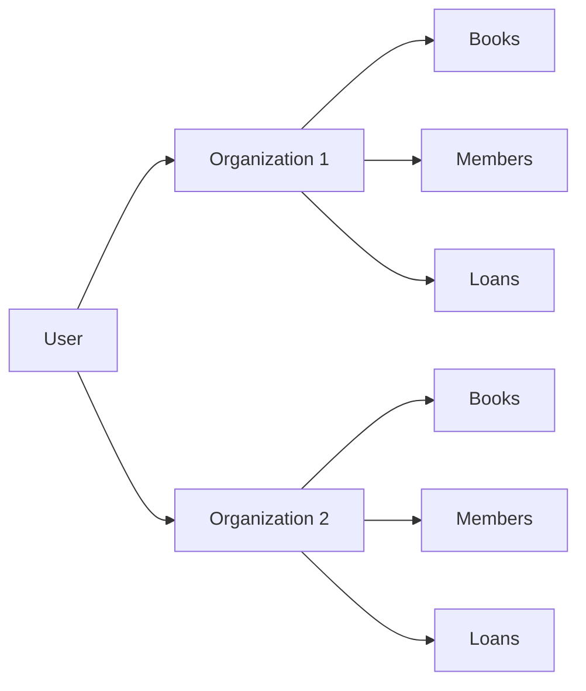
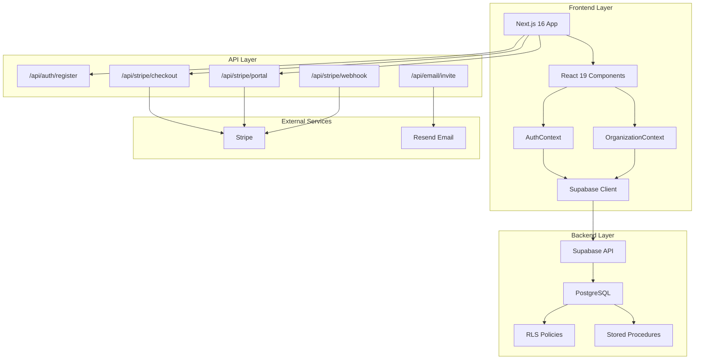
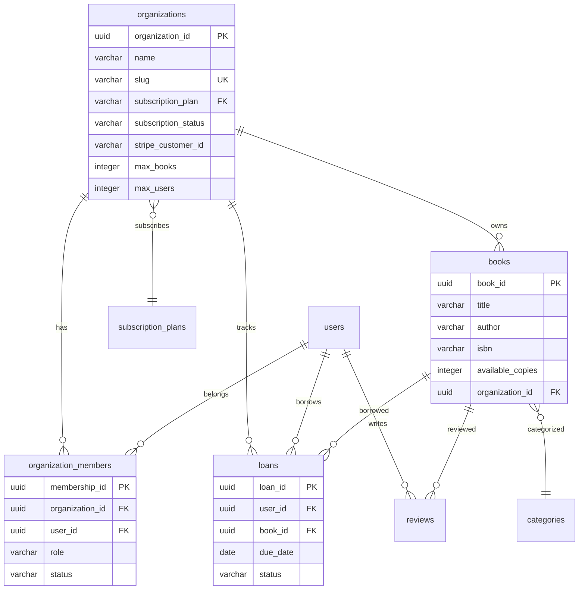
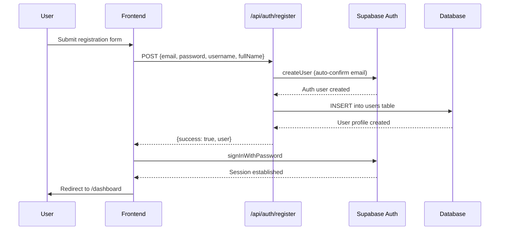
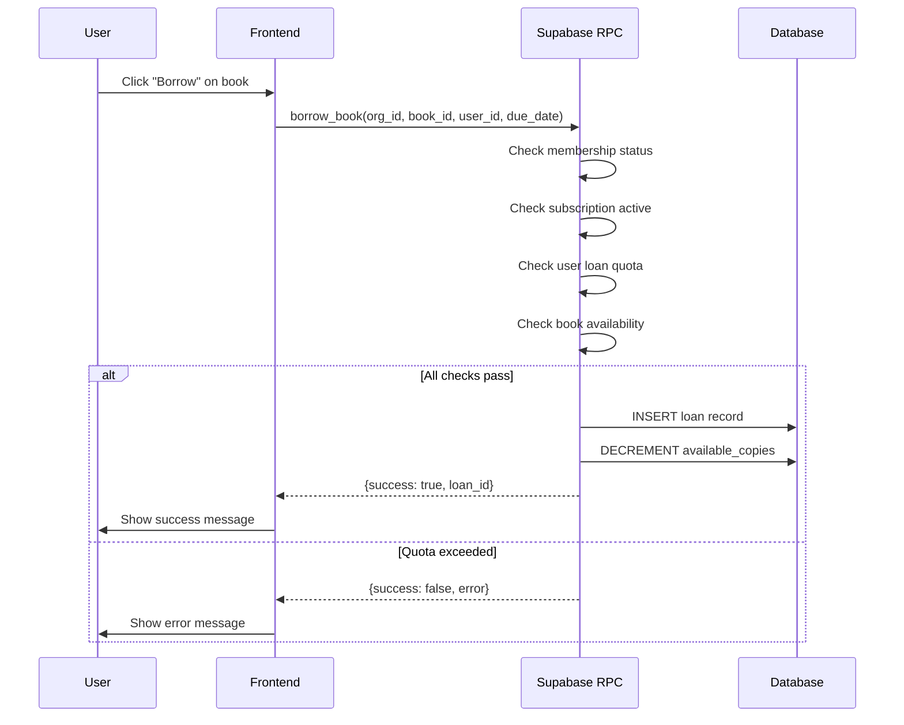
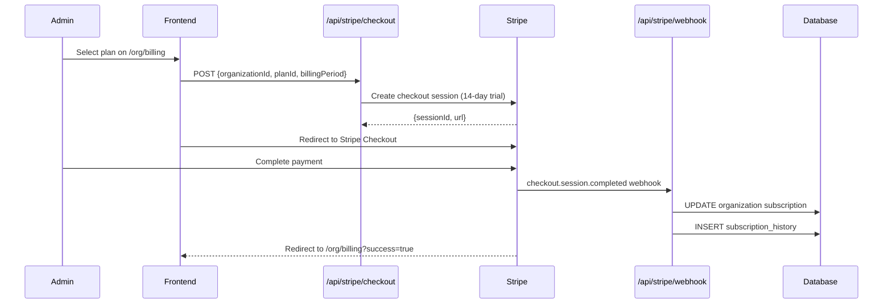

<div align="center"><a name="readme-top"></a>

[](#)

# 📚 LibraryOS<br/><h3>The Operating System for Modern Libraries</h3>

LibraryOS is a comprehensive multi-tenant library management system that enables organizations to manage their book collections, track loans, handle reservations, and manage team members with role-based access control.<br/>
Built with Next.js 16, React 19, TypeScript, Supabase, TailwindCSS 4, and Stripe for subscription billing.<br/>
One-click **FREE** deployment for your digital library transformation.

[Live Demo][demo-link] · [Documentation][docs-link] · [Report Bug][issues-link] · [Request Feature][issues-link]

<br/>

[][demo-link]

<br/>

<!-- SHIELD GROUP -->

[![][github-release-shield]][github-release-link]
[![][vercel-shield]][vercel-link]
[![][github-stars-shield]][github-stars-link]
[![][github-forks-shield]][github-forks-link]
[![][github-issues-shield]][github-issues-link]
[![][github-license-shield]][github-license-link]

**Share Repository**

[![][share-x-shield]][share-x-link]
[![][share-linkedin-shield]][share-linkedin-link]
[![][share-reddit-shield]][share-reddit-link]

<sup>🌟 LibraryOS: The operating system for modern libraries. Built for organizations, librarians, and book enthusiasts.</sup>

[![][github-trending-shield]][github-trending-url]

## 📸 Project Screenshots

> [!TIP]
> Experience the modern, intuitive interface designed for both librarians and library users.

<div align="center">
  
  <p><em>User Dashboard - Complete overview of borrowed books and library statistics</em></p>
</div>

<div align="center">
  
  
  <p><em>Book Catalog and Detailed Book Information</em></p>
</div>

<details>
<summary><kbd>📱 More Screenshots</kbd></summary>

<div align="center">
  
  <p><em>Secure Authentication System</em></p>
</div>

<div align="center">
  
  <p><em>Advanced Search and Filtering</em></p>
</div>

</details>

**Tech Stack Showcase:**

<div align="center">

 
 
 
 
 
 
 

</div>

</div>

> [!IMPORTANT]
> This is a **multi-tenant SaaS platform** where organizations can create isolated library environments. Features include Stripe subscription billing (Free/Basic/Pro/Enterprise plans), role-based access control (Owner/Admin/Librarian/Member), team invitations, and comprehensive book management.

<details>
<summary><kbd>📑 Table of Contents</kbd></summary>

#### TOC

- [📚 LibraryOSThe Operating System for Modern Libraries](#-libraryosthe-operating-system-for-modern-libraries)
  - [📸 Project Screenshots](#-project-screenshots)
      - [TOC](#toc)
      - [](#)
  - [🌟 Introduction](#-introduction)
  - [✨ Key Features](#-key-features)
    - [`1` Multi-tenant Organizations](#1-multi-tenant-organizations)
    - [`2` Smart Book Management](#2-smart-book-management)
    - [`3` Subscription \& Billing](#3-subscription--billing)
    - [`4` Role-based Access Control](#4-role-based-access-control)
    - [`*` Additional Features](#-additional-features)
  - [🛠️ Tech Stack](#️-tech-stack)
  - [🏗️ Architecture](#️-architecture)
    - [System Architecture](#system-architecture)
    - [Database Schema](#database-schema)
    - [Core Workflows](#core-workflows)
  - [⚡️ Performance](#️-performance)
  - [🚀 Getting Started](#-getting-started)
    - [Prerequisites](#prerequisites)
    - [Quick Installation](#quick-installation)
    - [Environment Setup](#environment-setup)
    - [Database Setup](#database-setup)
  - [🛳 Deployment](#-deployment)
    - [Vercel Deployment](#vercel-deployment)
    - [Environment Variables for Production](#environment-variables-for-production)
  - [📖 Usage Guide](#-usage-guide)
    - [For Organization Owners](#for-organization-owners)
    - [For Librarians](#for-librarians)
    - [For Members](#for-members)
  - [🔌 Integrations](#-integrations)
  - [⌨️ Development](#️-development)
    - [Development Commands](#development-commands)
    - [Project Structure](#project-structure)
  - [🤝 Contributing](#-contributing)
  - [📄 License](#-license)
  - [👥 Author](#-author)

####

<br/>

</details>

## 🌟 Introduction

This comprehensive library management system is designed for **organizations** that need to manage their book collections with team collaboration. Each organization operates in an isolated environment with its own books, members, and settings.

**Key Differentiators:**
- **Multi-tenancy**: Each organization has isolated data and settings
- **Subscription Plans**: Tiered pricing with different quotas and features
- **Team Management**: Invite members with different roles and permissions
- **Modern Stack**: Built with the latest versions of Next.js, React, and TailwindCSS

> [!NOTE]
> - Node.js >= 18.0 required
> - Supabase account required for database and authentication
> - Stripe account required for subscription billing
> - Modern web browser with JavaScript enabled

| [![][demo-shield-badge]][demo-link]   | Experience the system firsthand with our live demo - no installation required!                           |
| :------------------------------------ | :--------------------------------------------------------------------------------------------- |
| [![][discord-shield-badge]][discord-link] | Join our community of developers and library professionals. |

> [!TIP]
> **⭐ Star us** to receive notifications about new features and updates!

[![][image-star]][github-stars-link]

<details>
  <summary><kbd>⭐ Star History</kbd></summary>
  <picture>
    <source media="(prefers-color-scheme: dark)" srcset="https://api.star-history.com/svg?repos=ChanMeng666%2Flibrary-management-system&theme=dark&type=Date">
    
  </picture>
</details>

## ✨ Key Features

### `1` Multi-tenant Organizations

Create and manage multiple library organizations, each with isolated data and customizable settings.

**Organization Features:**
- 🏢 **Create Organizations**: Set up new library environments with custom branding
- 👥 **Team Management**: Invite members via email with role assignment
- 🔄 **Organization Switching**: Users can belong to multiple organizations
- ⚙️ **Custom Settings**: Configure loan duration, max loans per user, and more
- 📊 **Organization Stats**: Track books, members, loans, and usage

<div align="center">



</div>

[![][back-to-top]](#readme-top)

### `2` Smart Book Management

Experience next-generation library catalog management with intelligent search, real-time availability tracking, and automated inventory management.

<div align="center">
  
  <p><em>Advanced Book Catalog with Search and Filtering</em></p>
</div>

**Key Capabilities:**
- 🔍 **Smart Search**: Advanced search by title, author, ISBN, and categories
- 📚 **Real-time Inventory**: Live tracking of book availability and stock levels
- 🏷️ **Category Management**: Organized book classification system (global + org-specific)
- 📱 **Responsive Design**: Seamless experience across all devices
- 🖼️ **Cover Management**: Support for book cover images and placeholders
- ⭐ **Reviews & Ratings**: Members can rate and review books

[![][back-to-top]](#readme-top)

### `3` Subscription & Billing

Integrated Stripe subscription system with tiered plans and automatic billing.

| Plan | Max Books | Max Users | Max Loans/User | Price | Features |
|------|-----------|-----------|----------------|-------|----------|
| **Free** | 100 | 5 | 3 | $0 | Reservations, Reviews |
| **Basic** | 1,000 | 20 | 5 | $29/mo | + Reports |
| **Pro** | 10,000 | 100 | 10 | $99/mo | + Custom Branding |
| **Enterprise** | Unlimited | Unlimited | Unlimited | Custom | + API, SSO, Priority Support |

**Billing Features:**
- 💳 **Stripe Checkout**: Secure payment processing with 14-day trial
- 📊 **Billing Portal**: Self-service subscription management
- 🔄 **Auto-renewal**: Monthly or yearly billing cycles
- 📧 **Payment Notifications**: Email alerts for successful/failed payments
- 📜 **Billing History**: Complete audit trail of all transactions

[![][back-to-top]](#readme-top)

### `4` Role-based Access Control

Granular permission system with four distinct roles.

| Permission | Owner | Admin | Librarian | Member |
|------------|:-----:|:-----:|:---------:|:------:|
| Browse books | ✅ | ✅ | ✅ | ✅ |
| Borrow/return books | ✅ | ✅ | ✅ | ✅ |
| Write reviews | ✅ | ✅ | ✅ | ✅ |
| Add/edit books | ✅ | ✅ | ✅ | ❌ |
| Delete books | ✅ | ✅ | ❌ | ❌ |
| Manage members | ✅ | ✅ | ❌ | ❌ |
| Access billing | ✅ | ✅ | ❌ | ❌ |
| Delete organization | ✅ | ❌ | ❌ | ❌ |

[![][back-to-top]](#readme-top)

### `*` Additional Features

Beyond the core functionality, this system includes:

- [x] 🔐 **Secure Authentication**: Email-based authentication with Supabase Auth
- [x] 📧 **Email Invitations**: Send team invitations via Resend
- [x] 📊 **Analytics Dashboard**: Comprehensive statistics and reporting
- [x] 🔄 **Real-time Updates**: Live synchronization across all connected devices
- [x] 📱 **Mobile Responsive**: Perfect experience on smartphones and tablets
- [x] 🌙 **Dark Mode**: Eye-friendly dark theme with brand colors
- [x] 🔔 **Smart Notifications**: Toast notifications for all user actions
- [x] 📈 **Progress Tracking**: Visual progress indicators for all operations
- [x] 🛡️ **Row Level Security**: Secure data isolation at database level
- [x] 💚 **Brand Design**: Custom gradient theme with #02FF73 and #09ADAA

> ✨ More features are continuously being added based on user feedback and library needs.

<div align="right">

[![][back-to-top]](#readme-top)

</div>

## 🛠️ Tech Stack

<div align="center">
  <table>
    <tr>
      <td align="center" width="96">
        
        <br>Next.js 16
      </td>
      <td align="center" width="96">
        
        <br>React 19
      </td>
      <td align="center" width="96">
        
        <br>TypeScript 5
      </td>
      <td align="center" width="96">
        
        <br>Supabase
      </td>
      <td align="center" width="96">
        
        <br>Stripe
      </td>
      <td align="center" width="96">
        
        <br>TailwindCSS 4
      </td>
    </tr>
  </table>
</div>

| Layer | Technologies |
|-------|-------------|
| **Frontend** | Next.js 16 (App Router), React 19, TypeScript, TailwindCSS 4, shadcn/ui (Radix UI) |
| **Backend** | Supabase (PostgreSQL, Auth, RLS policies, Stored Procedures) |
| **Payment** | Stripe (Subscriptions, Checkout, Billing Portal, Webhooks) |
| **Email** | Resend (Transactional emails for invitations) |
| **State** | React Context (AuthContext, OrganizationContext) |
| **Forms** | React Hook Form + Zod validation |

> [!TIP]
> Each technology was selected for production readiness, developer experience, and seamless integration with the overall architecture.

## 🏗️ Architecture

### System Architecture



### Database Schema



### Core Workflows

<details>
<summary><kbd>🔐 Authentication Flow</kbd></summary>



</details>

<details>
<summary><kbd>📚 Book Borrowing Flow</kbd></summary>



</details>

<details>
<summary><kbd>💳 Subscription Payment Flow</kbd></summary>



</details>

## ⚡️ Performance

> [!NOTE]
> Performance optimizations ensure fast loading times and smooth user experience across all devices.

**Key Performance Indicators:**
- ⚡ **Lightning Fast**: < 2s initial page load
- 🚀 **Instant Navigation**: Client-side routing with prefetching
- 📱 **Mobile Optimized**: Perfect scores on mobile devices
- 🔄 **Real-time Updates**: < 100ms database synchronization
- 📊 **Efficient Rendering**: Optimized React 19 components

**Optimization Techniques:**
- 🎯 **Image Optimization**: Next.js Image component with lazy loading
- 📦 **Code Splitting**: Automatic route-based code splitting
- 🗄️ **Database Optimization**: Efficient PostgreSQL queries with indexes
- 🔄 **Caching Strategy**: Static generation where possible

## 🚀 Getting Started

### Prerequisites

> [!IMPORTANT]
> Ensure you have the following installed and configured:

- **Node.js** 18.0+ ([Download](https://nodejs.org/))
- **npm/yarn/pnpm** package manager
- **Git** ([Download](https://git-scm.com/))
- **Supabase Account** ([Sign up](https://supabase.com/))
- **Stripe Account** ([Sign up](https://stripe.com/)) - for billing features

### Quick Installation

**1. Clone Repository**

```bash
git clone https://github.com/ChanMeng666/library-management-system.git
cd library-management-system
```

**2. Install Dependencies**

```bash
# Using npm
npm install

# Using pnpm (recommended)
pnpm install
```

**3. Environment Setup**

```bash
# Copy environment template
cp .env.example .env.local

# Edit environment variables
nano .env.local
```

**4. Start Development**

```bash
npm run dev
```

🎉 **Success!** Open [http://localhost:3000](http://localhost:3000) to view the application.

### Environment Setup

Create `.env.local` file with the following variables:

```bash
# Supabase (Required)
NEXT_PUBLIC_SUPABASE_URL=https://your-project.supabase.co
NEXT_PUBLIC_SUPABASE_ANON_KEY=your-anon-key
SUPABASE_SERVICE_ROLE_KEY=your-service-role-key

# Stripe (Required for billing)
STRIPE_SECRET_KEY=sk_test_or_live_key
STRIPE_WEBHOOK_SECRET=whsec_your_webhook_secret

# Application
NEXT_PUBLIC_APP_URL=http://localhost:3000

# Email (Optional - for invitations)
RESEND_API_KEY=re_your_api_key
```

> [!WARNING]
> Never commit sensitive environment variables to version control. Use Vercel's environment variables settings for production.

### Database Setup

**Using Supabase CLI:**

```bash
# Start local Supabase
npx supabase start

# Apply migrations
npx supabase db reset

# Stop local Supabase
npx supabase stop
```

**Manual Setup:**
1. Create a new project on [Supabase](https://supabase.com/)
2. Run the migration files in `supabase/migrations/` in order
3. Configure RLS policies as defined in the migrations

## 🛳 Deployment

> [!IMPORTANT]
> The application is optimized for deployment on Vercel, but can be deployed on any platform that supports Next.js.

### Vercel Deployment

**One-Click Deploy:**

[](https://vercel.com/new/clone?repository-url=https%3A%2F%2Fgithub.com%2FChanMeng666%2Flibrary-management-system)

**Manual Deployment:**

```bash
# Install Vercel CLI
npm i -g vercel

# Deploy
vercel --prod
```

### Environment Variables for Production

| Variable | Description | Required |
|----------|-------------|----------|
| `NEXT_PUBLIC_SUPABASE_URL` | Supabase project URL | ✅ |
| `NEXT_PUBLIC_SUPABASE_ANON_KEY` | Supabase anonymous key | ✅ |
| `SUPABASE_SERVICE_ROLE_KEY` | Supabase service role key | ✅ |
| `STRIPE_SECRET_KEY` | Stripe secret key | ✅ |
| `STRIPE_WEBHOOK_SECRET` | Stripe webhook secret | ✅ |
| `NEXT_PUBLIC_APP_URL` | Application URL | ✅ |
| `RESEND_API_KEY` | Resend API key | 🔶 |

> [!NOTE]
> ✅ Required, 🔶 Optional

## 📖 Usage Guide

### For Organization Owners

1. **Create Organization** - Set up your library environment
2. **Configure Settings** - Set loan duration, max loans per user
3. **Invite Team** - Add librarians and members via email
4. **Subscribe** - Choose a plan that fits your needs

### For Librarians

1. **Manage Books** - Add, edit, and delete books
2. **Process Loans** - Handle borrowing and returns
3. **Track Inventory** - Monitor book availability

### For Members

1. **Browse Catalog** - Search and filter books
2. **Borrow Books** - Check out available books
3. **Write Reviews** - Rate and review books
4. **Track Loans** - View due dates in dashboard

## 🔌 Integrations

| Service | Purpose | Status |
|---------|---------|--------|
| **Supabase** | Database, Auth, RLS | ✅ Active |
| **Stripe** | Subscriptions, Billing | ✅ Active |
| **Resend** | Email Invitations | ✅ Active |
| **Vercel** | Hosting & Deployment | ✅ Active |
| **shadcn/ui** | UI Components | ✅ Active |

## ⌨️ Development

### Development Commands

```bash
# Development
npm run dev          # Start dev server
npm run build        # Build for production
npm run start        # Start production server
npm run lint         # Run ESLint

# Database
npx supabase start   # Start local Supabase
npx supabase stop    # Stop local Supabase
npx supabase db reset # Reset database
```

### Project Structure

```
src/
├── app/                    # Next.js App Router
│   ├── api/               # API routes
│   │   ├── auth/         # Authentication
│   │   ├── stripe/       # Stripe webhooks
│   │   └── email/        # Email sending
│   ├── books/            # Book pages
│   ├── dashboard/        # User dashboard
│   └── org/              # Organization pages
├── components/
│   ├── books/            # Book components
│   ├── layout/           # Layout components
│   ├── organization/     # Org components
│   └── ui/               # shadcn/ui components
├── contexts/             # React contexts
├── lib/                  # Utilities
└── types/                # TypeScript types
```

## 🤝 Contributing

We welcome contributions to improve the Library Management System!

**Development Process:**

1. **Fork the Repository**
2. **Create Feature Branch** (`git checkout -b feature/AmazingFeature`)
3. **Commit Changes** (`git commit -m 'Add some AmazingFeature'`)
4. **Push to Branch** (`git push origin feature/AmazingFeature`)
5. **Open Pull Request**

**Contribution Guidelines:**
- Follow TypeScript best practices
- Maintain consistent code style
- Add comments for complex logic
- Test your changes thoroughly
- Update documentation as needed

[![][pr-welcome-shield]][pr-welcome-link]

<a href="https://github.com/ChanMeng666/library-management-system/graphs/contributors" target="_blank">
  <table>
    <tr>
      <th colspan="2">
        <br><br><br>
      </th>
    </tr>
  </table>
</a>

## 📄 License

This project is licensed under the MIT License - see the [LICENSE](LICENSE) file for details.

## 👥 Author

<div align="center">
  <table>
    <tr>
      <td align="center">
        <a href="https://github.com/ChanMeng666">
          
          <br />
          <sub><b>Chan Meng</b></sub>
        </a>
        <br />
        <small>Creator & Lead Developer</small>
      </td>
    </tr>
  </table>
</div>

**Chan Meng**
-  LinkedIn: [chanmeng666](https://www.linkedin.com/in/chanmeng666/)
-  GitHub: [ChanMeng666](https://github.com/ChanMeng666)
-  Email: [chanmeng.dev@gmail.com](mailto:chanmeng.dev@gmail.com)
-  Website: [chanmeng.live](https://2d-portfolio-eta.vercel.app/)

---

<div align="center">
<strong>🚀 LibraryOS: The Operating System for Modern Libraries 🌟</strong>
<br/>
<em>Empowering organizations and readers worldwide</em>
<br/><br/>

⭐ **Star us on GitHub** • 📖 **Read the Documentation** • 🐛 **Report Issues** • 💡 **Request Features** • 🤝 **Contribute**

<br/><br/>

**Made with ❤️ for the library community**


</div>

---

<!-- LINK DEFINITIONS -->

[back-to-top]: https://img.shields.io/badge/-BACK_TO_TOP-151515?style=flat-square

<!-- Project Links -->
[demo-link]: https://library-management-system-chanmeng666.vercel.app
[docs-link]: https://github.com/ChanMeng666/library-management-system#readme
[issues-link]: https://github.com/ChanMeng666/library-management-system/issues

<!-- GitHub Links -->
[github-stars-link]: https://github.com/ChanMeng666/library-management-system/stargazers
[github-forks-link]: https://github.com/ChanMeng666/library-management-system/forks
[github-issues-link]: https://github.com/ChanMeng666/library-management-system/issues
[github-release-link]: https://github.com/ChanMeng666/library-management-system/releases
[github-license-link]: https://github.com/ChanMeng666/library-management-system/blob/main/LICENSE
[pr-welcome-link]: https://github.com/ChanMeng666/library-management-system/pulls

<!-- Community Links -->
[discord-link]: https://discord.gg/library-management
[vercel-link]: https://vercel.com

<!-- Shield Badges -->
[github-release-shield]: https://img.shields.io/github/v/release/ChanMeng666/library-management-system?color=369eff&labelColor=black&logo=github&style=flat-square
[vercel-shield]: https://img.shields.io/badge/vercel-online-55b467?labelColor=black&logo=vercel&style=flat-square
[discord-shield]: https://img.shields.io/discord/123456789?color=5865F2&label=discord&labelColor=black&logo=discord&logoColor=white&style=flat-square
[github-stars-shield]: https://img.shields.io/github/stars/ChanMeng666/library-management-system?color=ffcb47&labelColor=black&style=flat-square
[github-forks-shield]: https://img.shields.io/github/forks/ChanMeng666/library-management-system?color=8ae8ff&labelColor=black&style=flat-square
[github-issues-shield]: https://img.shields.io/github/issues/ChanMeng666/library-management-system?color=ff80eb&labelColor=black&style=flat-square
[github-license-shield]: https://img.shields.io/badge/license-MIT-white?labelColor=black&style=flat-square
[github-trending-shield]: https://trendshift.io/api/badge/repositories/123456
[pr-welcome-shield]: https://img.shields.io/badge/🤝_PRs_welcome-%E2%86%92-ffcb47?labelColor=black&style=for-the-badge

<!-- Badge Variants -->
[demo-shield-badge]: https://img.shields.io/badge/TRY%20DEMO-ONLINE-55b467?labelColor=black&logo=vercel&style=for-the-badge
[discord-shield-badge]: https://img.shields.io/discord/123456789?color=5865F2&label=discord&labelColor=black&logo=discord&logoColor=white&style=for-the-badge

<!-- Social Share Links -->
[share-x-link]: https://x.com/intent/tweet?hashtags=opensource,library,nextjs&text=Check%20out%20this%20amazing%20Library%20Management%20System&url=https%3A%2F%2Fgithub.com%2FChanMeng666%2Flibrary-management-system
[share-linkedin-link]: https://linkedin.com/sharing/share-offsite/?url=https://github.com/ChanMeng666/library-management-system
[share-reddit-link]: https://www.reddit.com/submit?title=Modern%20Library%20Management%20System&url=https%3A%2F%2Fgithub.com%2FChanMeng666%2Flibrary-management-system

[share-x-shield]: https://img.shields.io/badge/-share%20on%20x-black?labelColor=black&logo=x&logoColor=white&style=flat-square
[share-linkedin-shield]: https://img.shields.io/badge/-share%20on%20linkedin-black?labelColor=black&logo=linkedin&logoColor=white&style=flat-square
[share-reddit-shield]: https://img.shields.io/badge/-share%20on%20reddit-black?labelColor=black&logo=reddit&logoColor=white&style=flat-square

<!-- Images -->
[image-star]: https://via.placeholder.com/800x200/FFD700/000000?text=Star+Us+on+GitHub

<!-- Trending -->
[github-trending-url]: https://trendshift.io/repositories/123456

